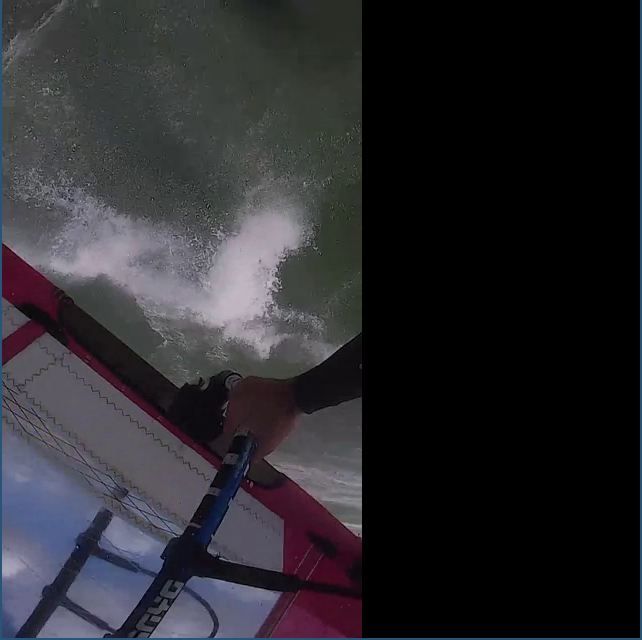

# Interface graphique

## Description

Drunk_player_gui permet de lire les vidéos d'un dossier et de les afficher
après avoir trop bu.

## Utilisation

```
usage: ./drunk_player_gui.out <folder>
```


## Exemple

```
$ ./drunk_player_gui.out ../data/
```




